# kwy

funguy项目-前端

## 目录结构

```
src
	assets
	components
	plugins
	router
	static
	views
	App.vue
	main.js
	store.js
```

## 项目内容

### 技术栈

前端：vue2 + elementUI + vuex

后台接口：nodejs + express + mongoDB

### 页面

#### PC

##### funguy首页：


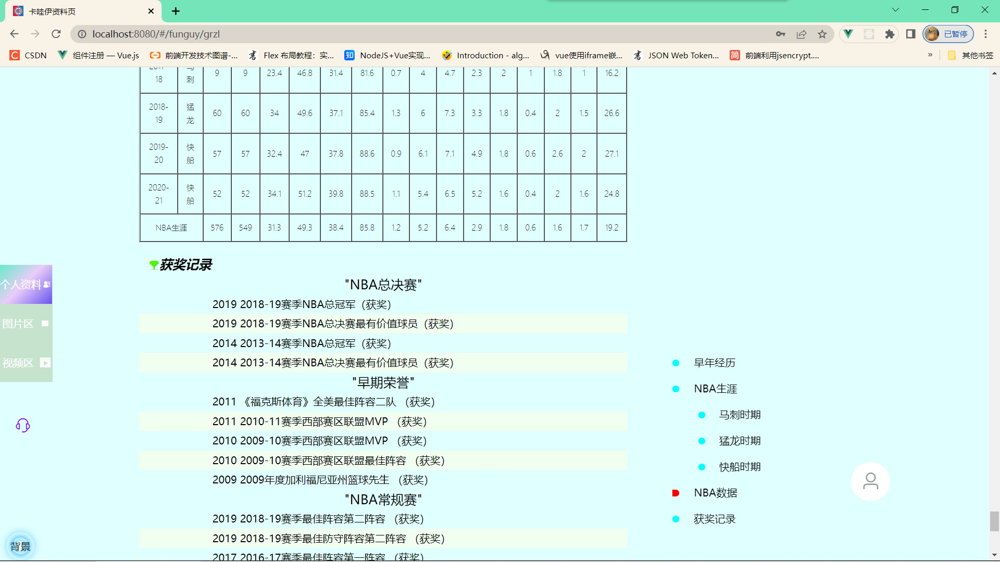

##### funguy图片页：

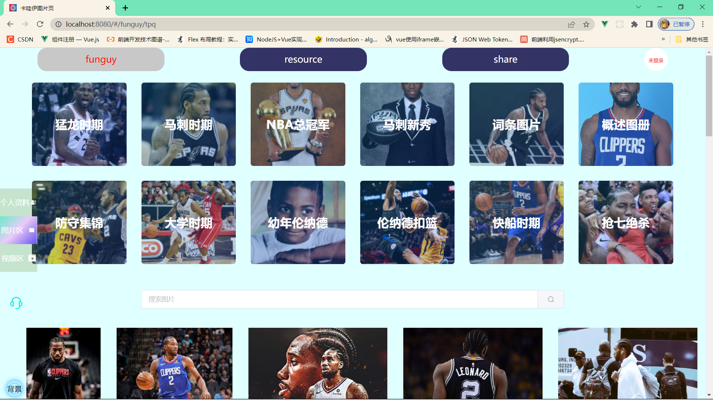

##### 注册登录页：

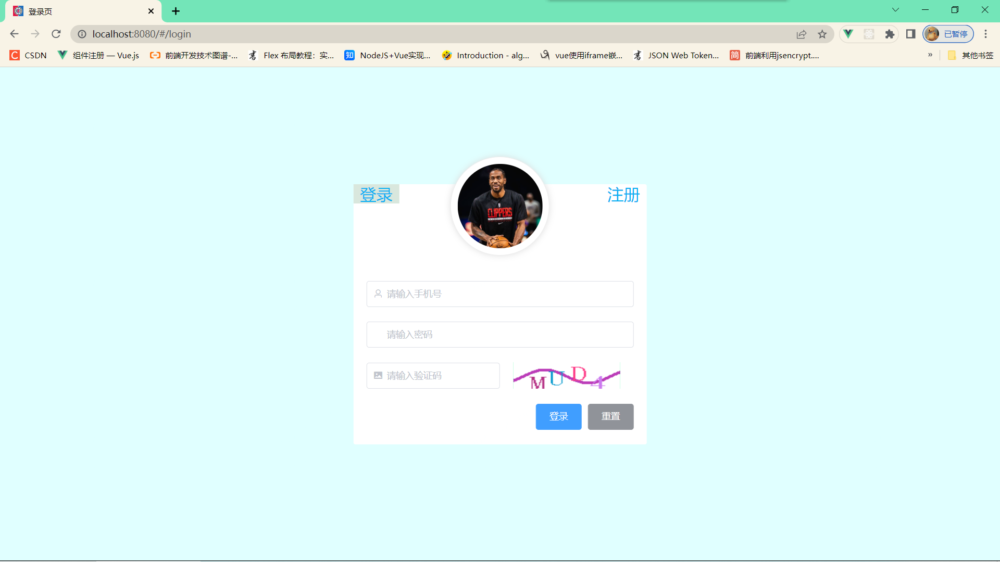

##### 个人信息页：

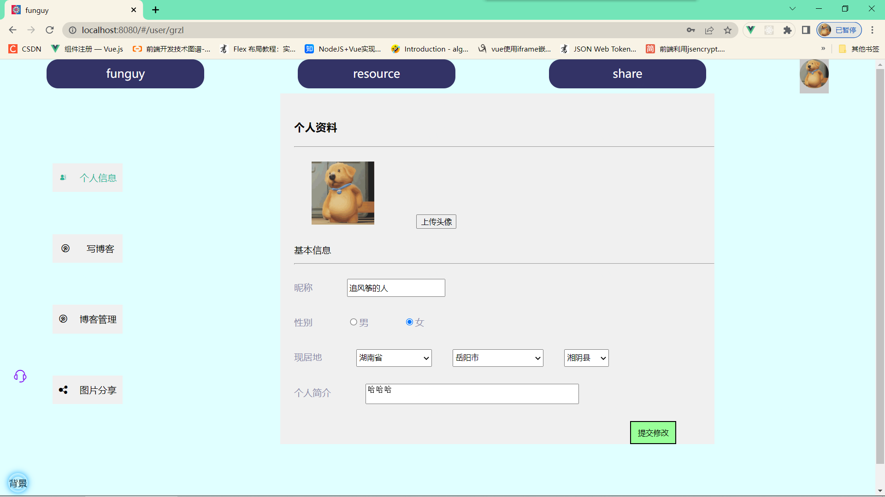

##### 个人博客编写页：

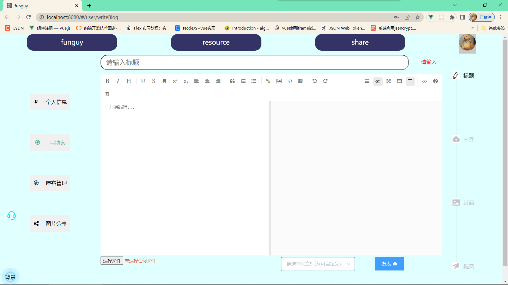

##### 个人博客管理页：

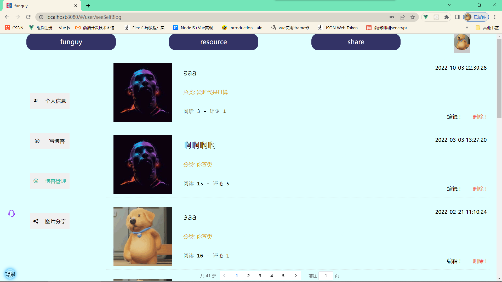

##### 个人图片分享页：

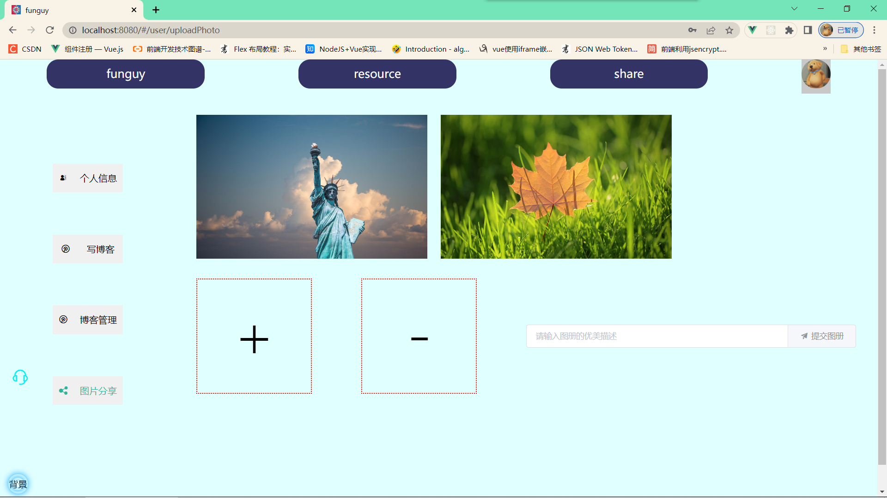

##### 分享博客查找页：

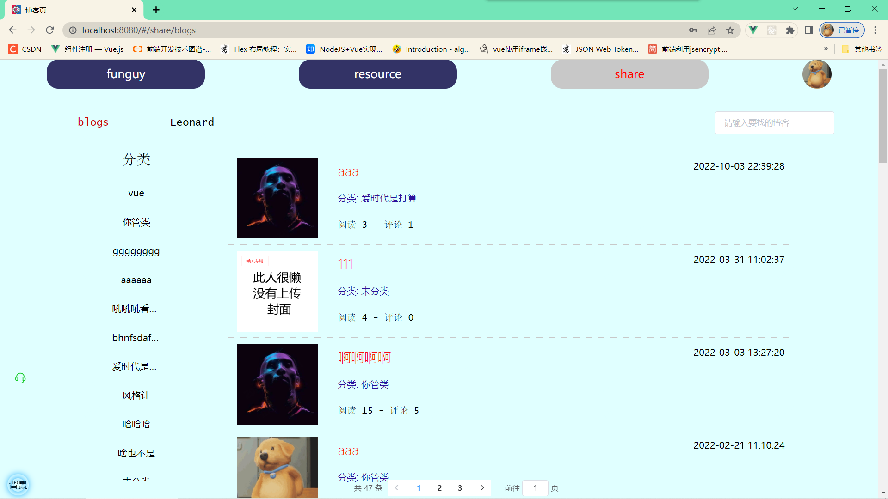

##### 分享图片查看页：


##### 博客详情页：

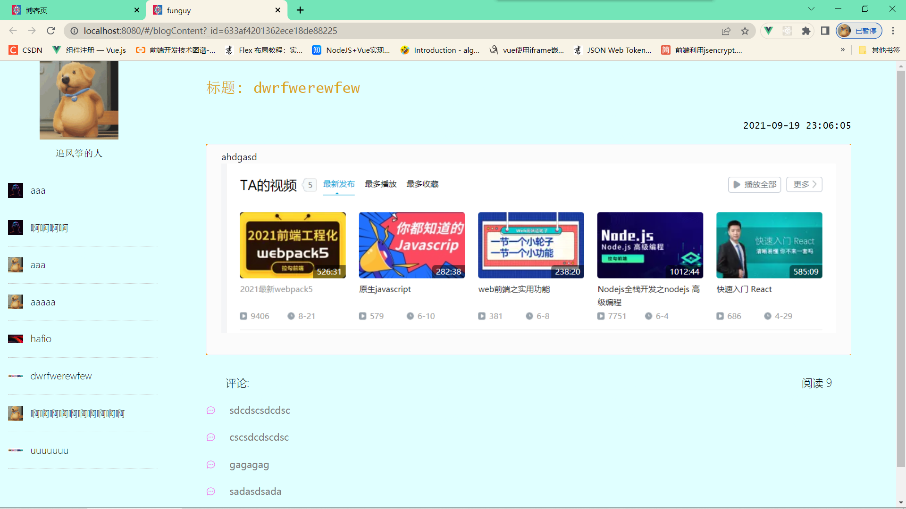

##### 分享图片查看页

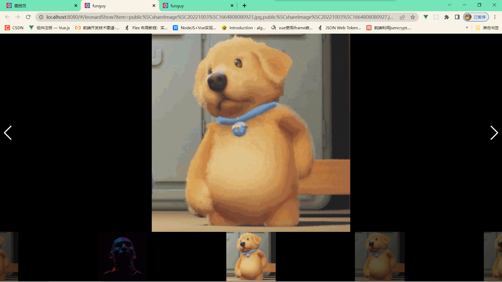

#### H5

##### video页

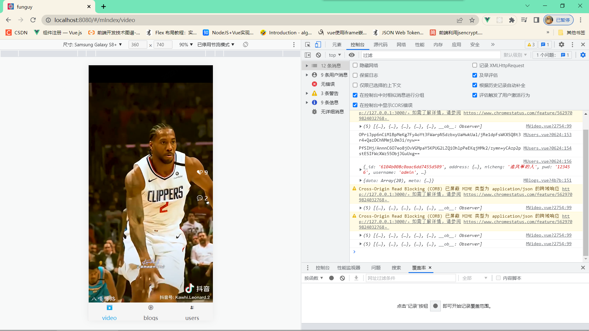

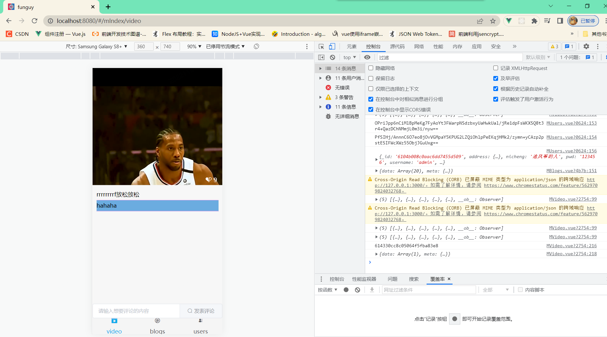

##### blogs页

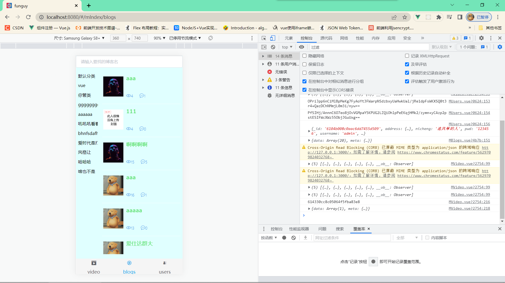

##### Users页

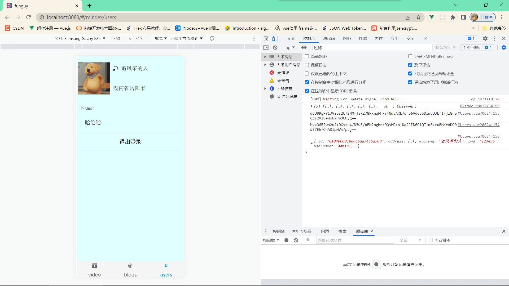

##### 博客查看页

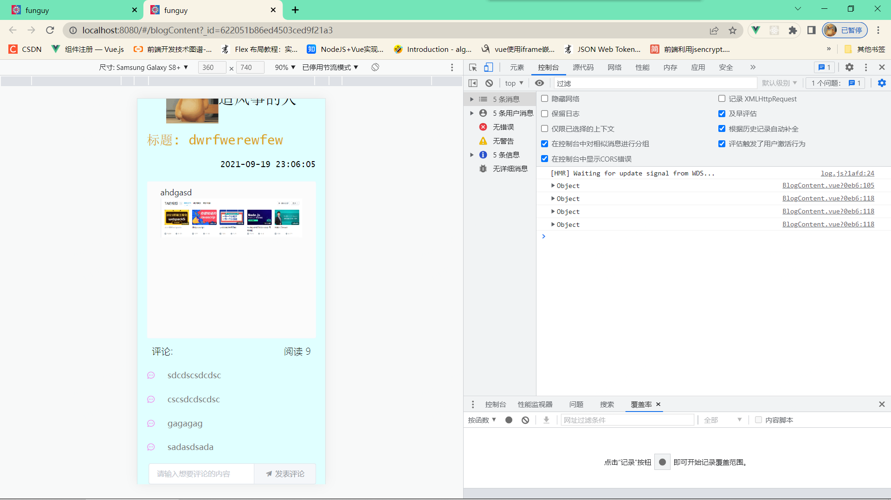

### 更新优化计划。。。
见update分支（刚开始）